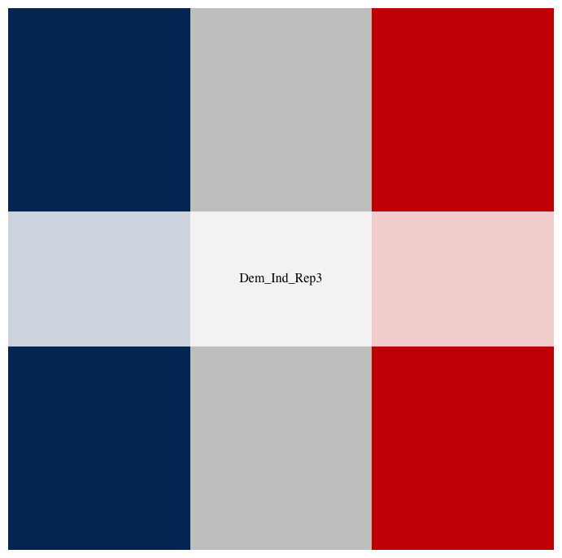

# `amerika`: An American politics-inspired color palette generator
[](http://cran.r-project.org/package=amerika)
[](http://cranlogs.r-pkg.org/)
[](http://hits.dwyl.io/{pdwaggoner}/{amerika})
[](https://github.com/pdwaggoner/amerika/pulls)

With a nod to Franz Kafka's first (and incomplete) novel, _Amerika_, the `amerika` package offers a variety of a American-politics inspired color palettes for a host of applications both in and out of politics. Building on Karthik Ram's approach to designing color palettes in the `wesanderson` package (with permission), `amerika` offers a variety of color palettes ranging from blue on the left to gray in the middle and red on the right.

Palette options range from only a few colors to several colors, but with discrete and continuous options to offer greatest flexibility to the user. `amerika` allows for a range of applications, from mapping brief discrete scales (e.g., three colors for Democrats, Independents, and Republicans) to continuous interpolated arrays including dozens of shades graded from blue to red (e.g., visualizing preference "feeling thermometers"). See below for a list of the palettes followed by a few political and non-political examples.

## Installation

 Get the latest (dev) version:

```{r }
devtools::install_github("pdwaggoner/amerika")
library(amerika)
```

Or get the latest stable release from CRAN:

```{r }
install.packages("amerika")
library(amerika)
```

## Use

Users simply supply the name of the desired palette in the main function `amerika_palette()`, along with the number of colors desired from the palette (e.g., only 4 from a 5-color palette), and whether "continuous" or "discrete" `type` mapping is desired. 

## Palettes 

1. `Republican`: three shades of red
2. `Democrat`: three shades of blue
3. `Dem_Ind_Rep3`: three colors including blue, gray, and red
4. `Dem_Ind_Rep5`: five colors including two shades of blue, one shade of gray, and two shades of red
5. `Dem_Ind_Rep7`: seven colors including three shades of blue, one shade of gray, and three shades of red

### Displaying each palette

```{r }
amerika_palette("Republican")
```


```{r }
amerika_palette("Democrat")
```


```{r }
amerika_palette("Dem_Ind_Rep3")
```



```{r }
amerika_palette("Dem_Ind_Rep5")
```


```{r }
amerika_palette("Dem_Ind_Rep7")
```


### Interpolating between existing colors based on the palettes using the "continuous" `type`

```{r }
amerika_palette(n = 50, name = "Republican", type = "continuous")
```


```{r }
amerika_palette(n = 50, name = "Democrat", type = "continuous")
```


```{r }
amerika_palette(n = 50, name = "Dem_Ind_Rep3", type = "continuous")
```


```{r }
amerika_palette(n = 50, name = "Dem_Ind_Rep5", type = "continuous")
```


```{r }
amerika_palette(n = 50, name = "Dem_Ind_Rep7", type = "continuous")
```


### (Fake) Political Cases (Discrete and Continuous)

```{r }
library(tidyverse)

data <- data.frame(sample(1:3, 3000, replace=TRUE))

data <- data %>%
  rename(pid = sample.1.3..3000..replace...TRUE.) %>%
  mutate(Party = recode(pid,
                        `1` = "Democrat",
                        `2` = "Independent",
                        `3` = "Republican")) %>%
  as.data.frame()

# Discrete: "political party" on a three point scale (hypothetical for demo purposes only)
ggplot(data, aes(Party)) +
  geom_bar(fill=amerika_palette(name = "Dem_Ind_Rep3")) + 
  theme_bw()
```


```{r }
library(tidyverse)
# Continuous: "ideology" on a 100 point scale (hypothetical for demo purposes only)
data1 <- data.frame(sample(1:100, 3000, replace=TRUE))

data1 <- data1 %>%
  rename(id = sample.1.100..3000..replace...TRUE.) %>%
  as.data.frame()

ggplot(data1, aes(id)) +
  geom_bar(fill=amerika_palette(n = 100, name = "Dem_Ind_Rep7", type = "continuous")) +
  labs(x = "Political Ideology (Liberal - Conservative)",
       y = "Count of Respondents") +
  theme_bw()
```


### Non-Political Cases (5 and 7 level palettes)

```{r }
library(tidyverse)

# 5-level (discrete) palette
ggplot(diamonds, aes(factor(cut), fill = factor(cut))) +
  geom_bar(fill=amerika_palette("Dem_Ind_Rep5")) + 
  theme_bw()
```


```{r }
library(tidyverse)

# 7-level (discrete) palette
ggplot(diamonds, aes(factor(color), fill = factor(color))) +
  geom_bar(fill=amerika_palette("Dem_Ind_Rep7")) + 
  theme_bw()
```


## How do I get `amerika`? 

While the package is available for download at [CRAN](https://CRAN.R-project.org/package=amerika), `amerika` is stored and developed at this GitHub repository, <https://github.com/pdwaggoner/amerika/>, along with an [issue tracker](https://github.com/pdwaggoner/amerika/issues/) for reporting bugs as well as suggesting package extensions and/or enhancements. In the spirit of open science, I welcome any level of interaction with the package.

